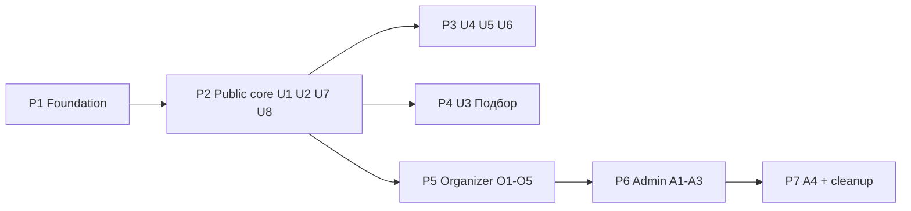

# Presence Swiss Grid Redesign — Master Plan

> **For agentic workers:** This is a **master roadmap**, not a single implementation plan. Each phase MUST be expanded into its own detailed implementation plan (via superpowers:writing-plans) immediately before execution, then executed with superpowers:subagent-driven-development or superpowers:executing-plans. Phase 1's detailed plan already exists: `docs/superpowers/plans/2026-07-28-swiss-grid-phase-1-foundation.md`.

> **SUPERSEDES** `docs/superpowers/plans/2026-07-24-redesign-master-plan.md` (the "Organic" direction from `docs/Redesign/1`). The client delivered a complete replacement design system on 2026-07-28: **Swiss International Typographic** ("Swiss Grid"), `docs/Redesign/5/design_handoff_presence_swiss_grid/`. The old plan's *hygiene* items (Phase 0: dev-note removal, QA-data purge, filter taxonomy, «Читательские группы» category) remain valid and are folded into this roadmap; everything visual in the old plan is dead.

**Goal:** Recreate all 17 handoff screens (8 user / 5 organizer / 4 admin) in the existing Next.js frontend, replacing the Liquid Glass identity with the Swiss Grid system: paper `#F2F0EC` + ink `#111`, zero border radius, zero shadows, 1px hairline rules, Archivo / Space Grotesk / JetBrains Mono, categories as numerals, red = "needs attention" only.

**Architecture:** All visual change flows through a rewritten token layer in `frontend/app/globals.css` (Tailwind v4 `@theme inline`) plus ~10 shared primitives built first. Screens are then restyled route-by-route against the handoff spec, reusing the existing data layer (`frontend/lib/api.ts`), auth, RSVP, moderation, and maps plumbing unchanged. No framework migration, no route renames (handoff routes map onto existing routes — table below).

**Tech Stack:** Next.js 16 App Router / React 19 / TypeScript, Tailwind CSS v4 (CSS-first tokens), `next/font/google` (Archivo, Space Grotesk, JetBrains Mono — all OFL), TanStack Query 5, react-hook-form + zod, Vitest 4 (node-only logic tests), Yandex Maps JS API v2.1, Go monolith backend.

## Source material

- Specification (source of truth): `docs/Redesign/5/design_handoff_presence_swiss_grid/README.md`
- Build brief: same dir `CLAUDE.md`; tokens: `tokens.css` / `tokens.ts`
- Visual reference (never copy markup): `Presence Swiss Grid - Full System.dc.html` — screens anchored by badges `U1…A4`
- Map treatment reference: `map-embed.html`

## Global Constraints (from the handoff — every phase inherits these)

- **Zero border radius anywhere. Zero shadows in-product.** Rules are 1px solid (2px only for nav active underline / focus outline).
- Colours only from the token sheet; max two background colours per screen (paper + ink). `signal` red `#E2231A` exclusively for needs-attention/destructive — never decorative.
- **Categories are numerals (`01`–`NN`), never colours.**
- **All numbers in JetBrains Mono** — dates, counts, seats, IDs, times, prices.
- Every uppercase run keeps its letter-spacing (0.07–0.18em per the scale table). Never round tracking to 0.
- Type scale per README table; body 12.5/11.5px; captions 9–10px uppercase.
- Hover **inverts** (ink bg / paper text), never tints; focus = 2px square ink outline; transitions 120ms linear on background/color only; loading = skeleton cells at final dimensions (`#ECEAE4`), never spinners; numbers show `—`.
- Every empty / auth-gated / error surface follows the U8 pattern (mono numeral, one-sentence explanation, 1–2 actions). 404 is inverted to ink.
- Tap targets ≥44px on touch; content caps at 1360px with 48px gutters (20px below 900px); breakpoints: desktop ≥1024, mobile ≤430, collapse below 720px.
- Admin = same components inverted to ink background (`#111` bg, `#F2F0EC` text, `#3A3733` inner rules); desktop-only except the A1 duty mode.
- No icon library — typographic characters only (`✓ → ← ♡ ⌕ ···`); tab-bar icons are plain squares.
- All UI copy Russian (handoff copy is final unless content team overrides); code/commits in English.
- Preserve existing behaviours: React #418 fix (no nested `<a>` in EventCard), Europe/Moscow-pinned formatters (`frontend/lib/format.ts`), pre-hydration script slot in `frontend/app/layout.tsx`, `NEXT_PUBLIC_*` build-args must be declared as `ARG` in the frontend Dockerfile.
- Frontend tests are Vitest node-only logic tests — every new pure helper gets a unit test; visuals verified in the live browser (Claude in Chrome) at 390px and desktop.
- Deploys per `docs/superpowers/runbooks/2026-07-23-qa-20-jul-deploy.md` (two build-args, 4 compose files, `--no-build`, post-deploy Docker prune).

---

## ⚠️ Decision checkpoints (recommended resolutions baked into the phases; flag to the user before Phase 1 executes)

1. **Dark mode is retired.** Swiss Grid is a single-theme (paper) system; admin inversion is a *surface*, not a theme. Recommended: remove the user-facing theme toggle (`ThemeSwitch`), the pre-hydration theme script, and `data-theme` plumbing; implement admin inversion as a `data-surface="ink"` scope that flips semantic tokens. This deletes a hard-won feature — needs user sign-off. (Fallback if the user objects: keep the toggle but map "dark" to the ink surface app-wide; the handoff does not design this.)
2. **Webfonts are now required — and the handoff's faces need Cyrillic substitutes.** Verified against the Google Fonts CSS API 2026-07-28: **Archivo and Space Grotesk ship NO Cyrillic subset** (latin/latin-ext/vietnamese only); JetBrains Mono has full Cyrillic. In an all-Russian UI the two handoff faces would fall back to system fonts on virtually every string — this is a handoff defect to raise with the design side. Recommended substitutes (all OFL, full Cyrillic, verified): **Golos Text** (400–900, Russian-designed grotesque — closest Swiss feel) for the Archivo role; **Manrope** (400/500/700) for the Space Grotesk role; JetBrains Mono kept as specified. All loading goes through `--font-ui`/`--font-alt`/`--font-mono` CSS vars via `next/font/google`, so a later swap (if design picks different faces) is a one-line change. Verify «Летний фестиваль медиаискусства» renders in the chosen faces in-browser during Phase 1.
3. **Maps stay on Yandex 2.1, restyled to the handoff treatment.** The handoff specifies Leaflet+OSM, but the *visual outcome* is what's specified: desaturated grayscale tiles, square ink numbered markers, restyled/hidden controls. Yandex 2.1 supports all of it (CSS `filter: grayscale(1) contrast(1.05)` on the map container, custom HTML marker layouts). Switching to Leaflet would discard working geocoding + venue-picker integration and the provisioned key for zero user-visible gain. Revisit only if the client demands OSM tiles specifically.
4. **Routes are kept, not renamed** (see mapping table). Handoff route names are descriptive, not contractual; renaming would break deployed links and the invite/verify email flows.
5. **U7 dedicated `/login` + `/signup` pages** are built as specified, but `LoginModal` (used inline by SignupCTA / CreateEventForm / ReportButton) is *restyled and kept* — killing the modal would force full-page redirects mid-registration flow. Both surfaces share the same form internals.
6. **Category numerals are positional**: numeral = zero-padded 1-based index of the category in the backend's ordered `GET /api/v1/categories` response (handoff lists 6; backend has 8+). Single source of truth helper `lib/category-numerals.ts` (built in Phase 1) — never hard-code the mapping.

## Route mapping (handoff → existing codebase)

| Handoff | Existing route | Notes |
|---|---|---|
| U1 `/events` | `/` (`app/page.tsx` + `DiscoveryFeed`) | feed stays the home page |
| U2 `/events/:id` | `/events/[id]` (`EventDetailView`) | exists |
| U3 `/discover` | `/search` (currently `ComingSoon` stub) | smart-filter fallback first (AI provider unsigned — `lia-ai-provider-constraint`) |
| U4 `/calendar` | `/me/calendar` | handoff blends public month + personal chips; restyle the existing personal calendar to U4; public all-events calendar = follow-up |
| U5 `/map` | `/map` (`MapBrowse`) | exists |
| U6 `/me` | **new** `app/me/page.tsx` | consolidates `/me/practices` + `/me/applications` data under U6 tabs; deep routes kept as redirects/links. «Избранное» tab **deferred** (no favorites backend); «Подписки» = existing followed organizers |
| U7 `/login` `/signup` | **new** pages + restyled `LoginModal` | |
| U8 states | `app/not-found.tsx` (**new**) + shared `EmptyState`/`AuthGate` components | |
| O1 `/org` | `/organizer` | |
| O2 `/org/events/new` | `/events/new` (`CreateEventForm`) | stepper is visual; keep one form instance + zod schema |
| O3 `/org/events` | `/events/mine` | |
| O4 `/org/events/:id/applications` | `/organizer/applications` + `EventApplicationsPanel` | bulk accept needs a small backend endpoint (or a client-side loop over `decideApplication` first) |
| O5 `/org/profile` | `/me/organizer` (+ public preview mirrors `/organizers/[id]`) | |
| A1 `/admin` | `/admin` | |
| A2 `/admin/moderation` | `/admin/moderation/events` | reason-chips + advance-to-next behaviour is new UI over existing takedown/reinstate API |
| A3 `/admin/organizers` | `/admin/organizers` (merge in `/admin/moderation/organizers` verify actions) | |
| A4 `/admin/users` | **new** page | **backend gap**: no user-registry or content-hygiene endpoints — Phase 7 includes the backend tasks or ships A4 without the hygiene rail |

## Known backend gaps (frontend stubs/defers until built)

- `POST /discover` (U3) — ship smart-filter fallback; escape hatch is mandatory regardless.
- Favorites (U6 «Избранное» tab, ♡ on U2) — defer both, or add `favorites` table + endpoints as a side quest.
- `GET /me` profile stats (Посещено / Подписки counts) — derivable client-side from existing fetches initially.
- Bulk accept applications (O4) — client-side sequential `decideApplication` loop is acceptable v1.
- `GET /org/summary` (O1 tiles + activity log) — tiles derivable from `fetchMyEvents`/applications; activity log deferred if no endpoint.
- `GET /admin/users`, `GET /admin/hygiene` (A4) — new backend work.

---

## Phase 1 — Foundation: tokens, fonts, primitives (est. 1 wk) → detailed plan **exists**: `2026-07-28-swiss-grid-phase-1-foundation.md`

The only global-blast-radius phase. Nothing else starts until the primitives render correctly in isolation.

- [ ] 1.1 Rewrite `frontend/app/globals.css`: Swiss Grid tokens (from handoff `tokens.css`) as semantic vars + `@theme inline` Tailwind mapping; `data-surface="ink"` inversion scope; kill glass utilities, radius/shadow tokens, dark-theme blocks.
- [ ] 1.2 Fonts via `next/font/google` in `app/layout.tsx` (Archivo 400–900, Space Grotesk 400/500/700, JetBrains Mono 400/700, `cyrillic` subset); remove theme script + `ThemeSwitch` (checkpoint 1); verify Cyrillic in-browser.
- [ ] 1.3 Type/tracking utilities (`.cap`, `.lbl`, `.kick`, chip/button text styles) so the 302 arbitrary `text-[Npx]` call sites can be replaced mechanically in later phases.
- [ ] 1.4 Six shared components per handoff spec: `AppHeader`, `Chip`, `Button` (rewrite), `Cell`, `EventModule` (replaces `EventCard` visuals), `BottomTabBar` (replaces `TabBar` visuals — tab set fixed at **Лента · Подбор · Карта · Я**).
- [ ] 1.5 Secondary primitives: `Field` (Input/Textarea/Select — kills the 13-file duplicated class), `ProgressBar`, `StatusChip` (+ status→variant map with unit test), `Stepper`, `Skeleton`, `EmptyState` (U8 pattern).
- [ ] 1.6 Pure helpers + tests: `lib/category-numerals.ts`, price display (`FREE` literal), status→chip map.
- [ ] 1.7 A `/design-preview` dev-only route rendering all primitives in both surfaces for browser verification; full-app smoke pass (app will look half-migrated — acceptable on a branch; **Phase 1 does not deploy alone**, it deploys with Phase 2).

## Phase 2 — Public core: U1 feed, U2 detail, U7 auth, U8 states (est. 1–1.5 wks)

- [ ] 2.1 U1 `/`: title block (`Москва · N событий · <месяц>` from live data), filter bar (time chips left / API-derived category chips right — folds in old-plan 0.3 taxonomy fix), 3-col hairline grid of `EventModule`s; mobile stacked rows + `BottomTabBar`.
- [ ] 2.2 U2 `/events/[id]`: cover strip, `1fr 200px` title/price block, four-`Cell` fact strip, venue block with restyled map + `МАРШРУТ` ghost; mobile sticky price+CTA footer; full-event `ЗАПИСАТЬСЯ` → `В ЛИСТ ОЖИДАНИЯ` ghost (SignupCTA logic reused, restyled). ♡ favorite deferred (backend gap).
- [ ] 2.3 U7 `/login` + `/signup` split-panel pages; restyle `LoginModal` internals to match; wire existing password auth + `?next=` resume.
- [ ] 2.4 U8: `app/not-found.tsx` (inverted 404), `EmptyState`/`AuthGate` rolled out to every currently-blank gated page; skeleton loading states replace blank divs.
- [ ] 2.5 Hygiene folded in (from old Phase 0): QA/test-data purge on prod DB (destructive — pg_dump first, unpublish not delete), «Читательские группы» migration if still missing.
- [ ] 2.6 **Deploy Phases 1+2 together**; live verify at 390px + desktop; Docker prune.

## Phase 3 — U4 calendar, U5 map, U6 profile (est. 1 wk)

- [ ] 3.1 U4 `/me/calendar`: month bar with mono title + chips, 7×5 grid with ink-filled event days (white numeral + category numeral), `#ECEAE4` blanks, `#E0DCD4` cell rules, right agenda rail with `Записан` chips and ghost `ДОБАВИТЬ В КАЛЕНДАРЬ` (existing .ics/Google links); mobile compact grid.
- [ ] 3.2 U5 `/map`: four-`Cell` stat strip, `230px 1fr` list+map, list numerals ≡ pin numerals, floating `ИСКАТЬ В ЭТОЙ ОБЛАСТИ` pill; map container `grayscale(1) contrast(1.05)`, square ink JetBrains-Mono-numbered markers via Yandex custom layouts (checkpoint 3); mobile stat strip → map → selected card → tab bar.
- [ ] 3.3 U6 new `/me`: identity strip, stat `Cell`s, tab chips with counts (Предстоящие / Прошедшие / Подписки; Избранное deferred), registration rows on the `56px 1fr 118px 134px` grid, inline empty note; fold `/me/practices` + `/me/applications` content in; mobile compact rows.
- [ ] 3.4 Deploy + verify.

## Phase 4 — U3 Подбор (est. 3–4 days for non-AI version)

- [ ] 4.1 Replace `ComingSoon`: prompt block + input row with ink `→` square, four suggestion chips, single-sentence answer strip, three result `EventModule`s with `Совпало: …` reasons, mandatory escape hatch (`Точные фильтры →` chip to `/`). Chip→filter mapping = pure helper + tests against existing events API.
- [ ] 4.2 (Deferred until AI provider sign-off) model-generated answer sentence over the same layout.

## Phase 5 — Organizer suite: O1 O3 O2 O4 O5 (est. 1.5–2 wks)

- [ ] 5.1 O1 `/organizer`: identity strip + `+ СОЗДАТЬ СОБЫТИЕ`, four-cell status strip (На модерации cell ink-inverted), red-left-border applications banner, next-event + activity split (activity log deferred if no endpoint); mobile sticky CTA.
- [ ] 5.2 O3 `/events/mine`: counting tab chips, `#E6E3DC` table header, `56px 1fr 96px 110px 92px` rows with seat fill bars + stacked `Ред./Копия` actions; mobile stacked rows.
- [ ] 5.3 O2 `/events/new` + edit: four-step `Cell` stepper over the existing single RHF/zod form (steps are visual sections; schema tests keep passing), autosave-time header chip, live `EventModule` preview on white card, moderation note; mobile 4-segment progress bar.
- [ ] 5.4 O4 `/organizer/applications`: context strip with capacity cell + fill bar, tab chips, `26px 1fr 120px 150px` rows with square checkboxes + inline ПРИНЯТЬ/ОТКЛОНИТЬ, pinned bulk bar (client-side bulk loop v1); optimistic seat counter.
- [ ] 5.5 O5 `/me/organizer`: verification stepper (existing states map to 01/02/03), form left / white public-preview card right; public `/organizers/[id]` restyled to match the preview.
- [ ] 5.6 Deploy + verify.

## Phase 6 — Admin inverted: A1 A2 A3 (est. 1 wk)

All under `data-surface="ink"` in `app/admin/layout.tsx`; replace the bespoke admin nav with `AppHeader` admin variant (`PRESENCE / ADMIN`). Desktop-only (min-width notice below 900px) except A1 duty mode.

- [ ] 6.1 A1 `/admin`: four stat tiles (Ждут модерации on `#E2231A` fill), moderation + verification queues side by side, `Сигналы` footer; mobile duty mode.
- [ ] 6.2 A2 `/admin/moderation/events`: `250px 1fr` queue/record layout, paper-filled selected row, rejection-reason chips (≥1 required to reject), ОДОБРИТЬ/ОТКЛОНИТЬ/НА ДОРАБОТКУ bar, auto-advance to next item. Requires reasons in the takedown API call (exists: takedown takes a reason string — chips concatenate).
- [ ] 6.3 A3 `/admin/organizers`: filter chips + search, six-column table, contextual row actions, red test-organizer rows; absorb `/admin/moderation/organizers` verify/reject actions here.
- [ ] 6.4 Deploy + verify.

## Phase 7 — A4 users + content hygiene (backend + frontend, est. 1 wk)

- [ ] 7.1 Backend: `GET /admin/users` (id, name, email, registered month, booking count, role incl. test-flag heuristics) + `GET /admin/hygiene` (test-data / suspicious-price detections) + `POST /admin/hygiene/hide-all`; migrations if needed.
- [ ] 7.2 Frontend A4 `/admin/users`: `1fr 300px` split, user registry table, Гигиена контента rail with destructive `СКРЫТЬ ВСЁ ИЗ ЛЕНТЫ`.
- [ ] 7.3 Final sweep: delete dead Liquid Glass code (`glass` utilities, `ThemeSwitch`, old cover gradients in `lib/covers.ts`, `CategoryGlyph` decorative uses), font preload check (Archivo 900 + JetBrains Mono 700), Lighthouse/CLS pass, deploy, prune.

---

## Sequencing

P1+P2 deploy together (P1 alone leaves the app visually incoherent). P3/P4/P5 are independent after P2 and can be parallelized in worktrees (`concurrent-sessions-shared-worktree` gotcha applies). Admin last — it reuses everything and inversion shakes out token bugs.

## Restyle risk register (from the 2026-07-28 code inventory — address in the phase that touches each)

1. Stale `.dark .glass` blocks in `globals.css` are dead code — deleted in P1.
2. Hard-coded hexes: `ui/Switch.tsx`, `ui/ThemeSwitch.tsx` (deleted P1), `lib/covers.ts` gradients (P2 — covers become plain `object-fit: cover` photos, no gradients).
3. Raw Tailwind status colors (`green/amber/red-*`) in ~32 files → replaced by `StatusChip` per phase; no new `--warning`/`--success` tokens exist in Swiss Grid (statuses are ink/default/signal chips only).
4. ~302 arbitrary `text-[Npx]` — replaced with P1 type utilities as each screen is touched; grep-verify zero remaining in P7.
5. 13-file duplicated input class → `Field` primitive in P1.
6. `cn()` is naive concat — P1 swaps to `clsx` + `tailwind-merge` (tiny, prevents override bugs during mass restyle).
7. `TabBar` mounted globally in root layout (shows on admin/auth pages) → P1 `BottomTabBar` renders only on user-layer routes; admin/organizer mobile use header context per handoff.
8. Admin layout duplicates nav → P6 uses `AppHeader` admin variant.
9. Preserve: React #418 fix, Moscow-pinned formatters, `suppressHydrationWarning`, `NEXT_PUBLIC_*` ARG declarations.
10. Admin pages use raw `useEffect`+`tick` instead of TanStack Query — restyle only; query migration is out of scope (note for later).

## Per-phase working agreement

For every phase: isolated worktree (`superpowers:using-git-worktrees`), detailed implementation plan via `superpowers:writing-plans` (full code, TDD steps for pure helpers), execute task-by-task, `pnpm test` + lint, verify live in browser at 390px + desktop against the `.dc.html` reference screen, request code review, merge to `main`, deploy per runbook, verify on https://presence.tarski.ru, prune Docker.

## Definition of done (whole redesign)

- All 17 screens match the reference at both breakpoints; grep finds zero `rounded-`, `shadow-`, glass, or raw-palette status classes in `frontend/` (excluding node_modules).
- Every number renders in JetBrains Mono; every uppercase run has tracking; red appears only in the enumerated needs-attention spots.
- Empty/loading/gated/error states designed on every route; keyboard navigable with 2px square focus outlines.
- All existing Vitest suites pass + new helper tests; live verification evidence per phase.
